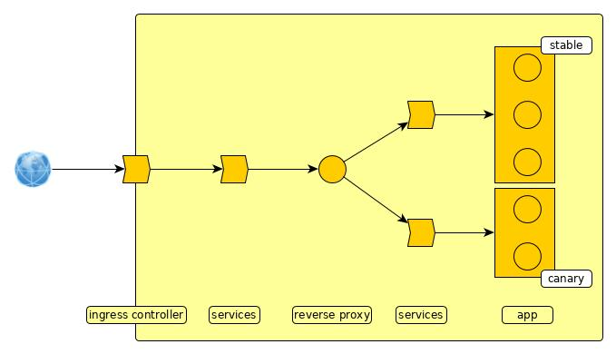

# Affinity with the canary

This idea is based on:

	https://medium.com/google-cloud/kubernetes-canary-deployments-for-mere-mortals-13728ce032fe
	https://github.com/Telefonica/nginx-canary
	

## What's the idea

To build a simple way of deploy some kind of canary with a consistent user experience on top of Kubernetes.

## Goals

	1. Allow a simple way of canary deployment with weights
	2. Once the user accessed canary or stable keep her/him stuck to this deploy (consistent user experience)
	
## Motivation

Despite the fact that tools already exist to perform canary each one has a drawback.

**Basic K8s** features to do canary (to have a lot of pods with stable and canary and load balance between them) it's not enaugh since it can't handle stickiness.

**NGINX Ingress Controller** can handle session affinity, on one hand, and canary, in the other. But it is hard (or impossible) to put both features to work toghether.

I think tools like **istio** and **fabio** (*Consul*) have the features to do this... but they are oversized to our needs.

## The solution

This solution is built using a reverse proxy and a *lua* script to handle the *canary* and the cookies that allows the *sticky session*.

Basically this is it:

We have two versions for our app: stable and canary. 

Despite the qty of pods each one has its own service on front of it.

On front of these services we add a reverse proxy. It will handle mainly two activities: look for the cookie and (if cookie does not exist) split traffic between stable and canary based on *canary weight*.

On front of the reverse proxy there is a service, which is hitted by the traffic from ingress controller.

## How to implement the solution

Just edit these values in file *affinity-with-the-canary.yaml*:

        - name: BASE_SVC_URL
          value: ".canary.svc.cluster.local"
        - name: STABLE_SVC_NAME
          value: kubeapp-production-service
        - name: CANARY_SVC_NAME
          value: kubeapp-canary-service
        - name: CANARY_WEIGHT
          value: "0.5"
        - name: COOKIE_MAX_AGE
          value: "172800"

`BASE_SVC_URL` is composed of namespace (*canary* in the example) and the base url for your cluster (this is almost standard).

`STABLE_SVC_NAME` and `CANARY_SVC_NAME` are the name of your apps' services.

`CANARY_WEIGHT` is the weight, number between 0 and 1. If random number is less or equal to `CANARY_WEIGHT` the request is sent to canary.

`COOKIE_MAX_AGE` set the max-age for the cookie. (seconds)

Finally, deploy your reverse proxy and point your ingress controller to the *nginxcan-service* service.

**Note:** All this stuff must be deployed inside the same namespace.

**Note:** there is defined a standard dns resolver (*kube-dns.kube-system.svc.cluster.local*), if you do not use the standard you must change it.

## How to deactivate canary

If you want to deactivate canary (because you have no canary, have problems with canary or whatever it be...) you can set `CANARY_WEIGHT` to 0 and deploy *affinity-with-the-canary*.

All requests, despite the cookie can be set to canary, will be redirected to stable (and cookie re set accordingly).

---

# Example

To see an explanation of the example on this solution please go [here](https://juanmatiasdelacamara.wordpress.com/2019/03/14/simple-canary-with-affinity-on-k8s/)

